# Project: Behavioral Cloning

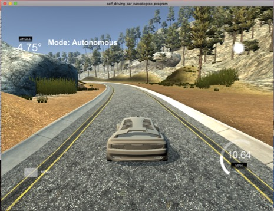

## Outline

In this project a car is trained using convolutional neural network (CNN) to drive autonomously inside the Udacity simulatori (autonomous mode).
Training data is generated by simulations runs inside the simulation (training mode)

## Files

The following file were used:

* model.py, python script containing the creation, training and output of the CNN model.
* drive.py, python script for driving the car inside the simulator in autonomous mode.
* model.h5, file containing the trained model including weights & bias.
* video.mp4, file containing the recording of the car running inside the simulator in autonomous mode.
* writeup_report.pdf, this report.
* README.md, this file
* pics/*.jpg, images of README.md file

* model.ipynb, (optional) notebook script containing the code of model.py plus additional code for  training set and image pre-processing visualization.

Note:   Training date-set is not provided.

## Approach

To drive the car autonomously in the Udacity simulator using behavioural cloning, I have performed the following steps:

### 1. Gathering Training Data

#### Simulator Training Data
The Udacity simulator has a recording option which saves a simulation run. The recorded data consists of colour images (resolution 160x302x3) over time from the centre, left and right camera of the car and a CVS file driving_log.cvs. The CVS file lists the steering angle, throttle and speed of the car for centre camera images.
The figure below shows an extract of the CVS file.

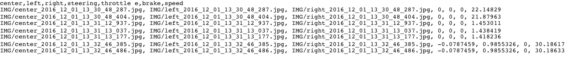

#### Training-set (code lines 13-55)
The recorded data of simulation runs were used as training data for a convolutional neural (CNN) model. Input of the CNN model were the images from the simulator and output were the steering angle of the car (to predict). I used 3 different recorded data-sets:

    1) the Udacity provided data-set of track 1
    2) a generated data-set of track 1, driving anti-clockwise and focusing on smooth turns (2 x laps)
    3) a generated data-set of track 1, driving clock-wise (3 x laps)

#### Multiple Cameras (code lines 66-104)
In order to increase the number data-points I used all 3 camera images. Since there is only one steering angle value for the centre camera image given and I calculated the steering angle value for the left and right camera image by adding 0.25 to the steering value for the left- and subtracting 0.25 of the steering value for the right camera. These steps did increase the training-set by factor 3. The figures below present the camera images of simulation run.

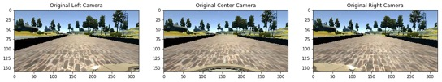

#### Augmentation (code lines 111-132)
Additionally, I augmented images to increase and normalize the training-set. I used the following approach: images were flipped horizontally and the according steering value was corrected by multiplying -1.0 to the original value. This augmentation was only used for “non-straight driving” images with an absolute steering value > 0.21 which resulted in a better normalization of the distribution of the training-set.

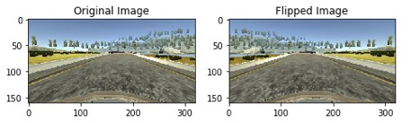
    
##### Optimization (code lines 43-55)
Furthermore, I optimized the training-set by removing “straight driving” images of the centre camera by almost 90% from the original data-set (images read from the simulation runs). Rationale for this step was that the data-set did contain too much “straight driving” images which resulted in poor autonomous driving behaviour @ the simulator. With this images removal the model did drive through the track 1 successfully.

### 2. Adapting the CCN Model

#### NVIDIA CNN Model (code lines 219-282)
I used the CNN architecture model from NVIDIA https://devblogs.nvidia.com/parallelforall/deep-learning-self-driving-cars/ to train the car to drive autonomously. The model was implemented using the python Keras library. It uses a normalization layer [-1,1] using the Lambda layer, a RELU activation function after each convolution layer and fully connected network layers, expect for the logits layer.

#### Pre-processing (code lines 142-152)
Because the NVIDIA CNN model uses YUV input images of 66x200x3 and the data-set from the simulator outputs RGB images of 160x320x3 the training-set images need to be pre-processed. 
The first pre-processing step was to crop the images in order to remove unecessary info. The images were cropped on the top by 60 pixels to remove trees and other non-road info and 20 pixels from the bottom to cut out the hood.

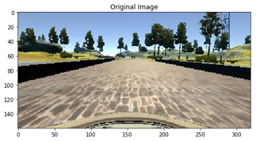
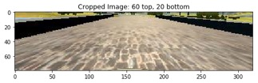

Next pre-processing step was to resize the cropped image from the 80x320x3 to the 66x200x3 format using the cv2.resize() function. Last step is to colour-convert of the resized images to YUV. 
All these steps were coded in the process66x200() python which is used by model.py and drive.py.

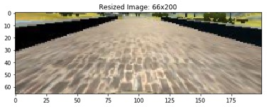
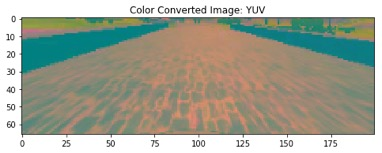

#### Training & Validation (code lines 152-192, 199-212, 282)
The CNN model used the Adam optimizer and optimizes on loss using the MSE algorithm (code line 282)
The training and validation data-set were generated from the data-set by the ratio 80% training and 20% validation using the train_test_split() function from the  sklearn.model_selection library (code lines 199-212)
In order to reduce memory consumption a generator was used for training and validation data (code lines 152-192)
There was observed no over-fitting during the training the CNN model. Therefore, against over-fitting actions like dropout were evaluated but not used.
The CNN model performed quite well on the data-set. I achieved 0.0116 training and 0.0122 validation loss 
after 6 epochs training the final model. 

    python model.py  

    40694/40694 [==============================] - 64s - loss: 0.0122 - val_loss: 0.0124
    Epoch 6/6
    40694/40694 [==============================] - 64s - loss: 0.0116 - val_loss: 0.0122

    debug: saved model: model.h5

### 3. Running the Simulator in autonomous mode 
In order to verify the model for autonomous driving, the model has to be executed in the simulator using autonomous mode for track 1. 

    python drive.py model.h5

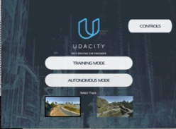
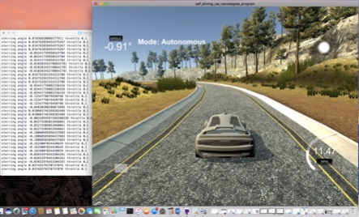
  

This step is absolutely necessary in order to verify the result plus to get feedback about the training-set and model the performance. i.e. I have observed that a “good” model in terms of training and validation loss did not perform well on the simulator because the training-set were not sufficient. Therefore, I did remove “straight driving” images from the original training-set.
Note: the python script drive.py was modified by adding the pre-processing routine process66x200() and by setting the throttle value to 0.1.

## CNN Model

The convolutional neural model is based on the NVIDIA CNN model architecture as described in the paper  https://devblogs.nvidia.com/parallelforall/deep-learning-self-driving-cars/. The CNN architecture is described in the table and figure (source NVIDIA) below:

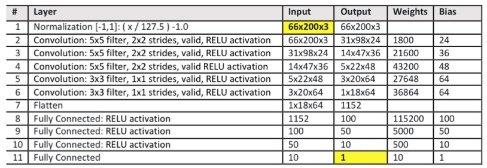
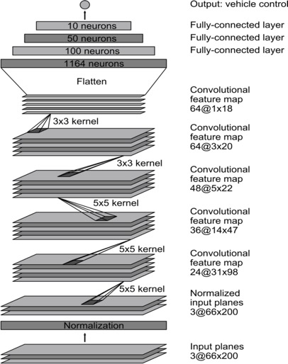

## Training Strategy

### 1. Data-set
As described in previous section, the training-set has been generated from 3 different simulation runs and used all 3 camera images. The table below summaries the data-set sizes and the total number of images (centre, left and right camera) available.

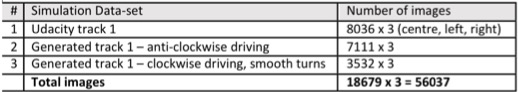

### 2. Data-set Analysis & Optimization
In order optimize the data-set for CCN training the distribution of the data-set needs to be analysed.
The figure below presents the distribution steering angle of centre camera images of the total data-set.

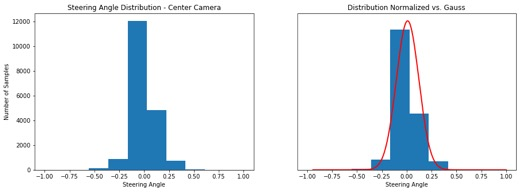

    Center Camera - Steering Angle: mean 0.00938079869045 derivation 0.113207331028 number of samples 18679

        
Observation:    The distribution of the figure above is not normalized regarding steering angle values. There is a big peak between 0.0 and 0.2

In order the normalize the steering angle distribution I did remove ‘straight driving’ images from the data-set by 90%. The figure below presents the “new” distribution.

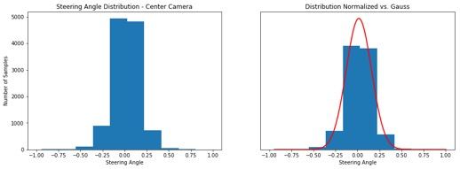

    Center Camera - Steering Angle: mean 0.0151630268898 derivation 0.143623859592 number of samples 11556

        
The figure below presents the distribution after adding the left and right camera images with the steering correction factor (+0.25 for left and 0.25 for right images).

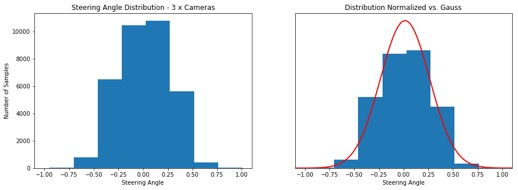

    3 x Cameras - Steering Angle: mean 0.0151630268898 derivation 0.249588620956 number of samples 34668

        
in order to increase the data-set and to further normalized the according distribution I used the following image augmentation approach: Images were flipped horizontally and its steering angle value were multiplied  -1.0.  I did generate augmented images only for images which absolute steering angle value were bigger than a certain steering threshold, in my case 0.21. Doing this could “control” a little bit the shape of the resulting distribution. The figures below present the final data-set distribution for different thresholds.

    
* Threshold = 0.21 (used for final data-set)

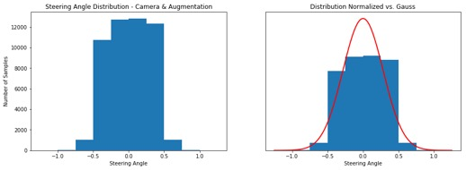

    Camera & Augmented Data - Steering Angle: mean -0.000490209639085 derivation 0.283083521041 number of samples 50868

* Threshold = 0.0

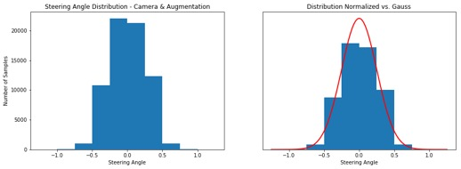

    Camera & Augmented Data - Steering Angle: mean 1.99028674981e-17 derivation 0.251487415499 number of samples 68545

* Threshold = 0.5

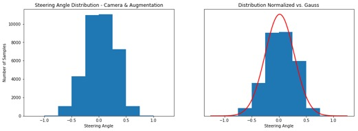

    Camera & Augmented Data - Steering Angle: mean 0.0137602820546 derivation 0.266436875785 number of samples 35763

        
## Conclusion

In this project I observed that the quality and distribution of the training-set is extremely important for behavioral cloning.

* Quality: Since the CNN model “learns” on the data-set. There is a problem if the data-set is poor because model will be mimic by all actions of the data-set. In case of autonomous driving, if the simulated data-sets are not very accurate or cases missing, the car cannot drive successfully in autonomous way (I did experience this myself generating data-sets from the simulator).

* Distribution of data-set: The distribution of the data-set impacts the learning process & performance of the model. The data-set need to be normalized i.e. by augmentation or according data selection.
